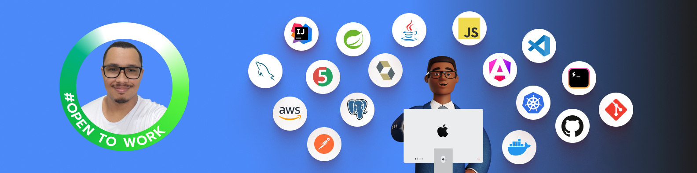
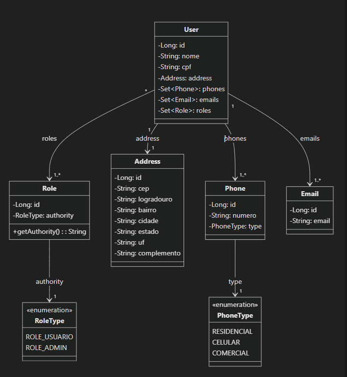

 <br><br>

 <br>

## API Desafio Backend SEA TECNOLOGIA
API com Segurança Customizada, protegida com OAuth2, JWT e Spring Security.
## Visão geral
Este projeto é uma API RESTful segura para gerenciamento de usuários e produtos construída com Spring Boot, apresentando autenticação e autorização usando OAuth2 e JWT. O sistema inclui recursos abrangentes de gerenciamento de usuários e produtos com controle de acesso baseado em função, validação de endereço e gerenciamento de número de telefone.

## Características
- Operações CRUD do usuário e produtos com controle de acesso baseado em função
-  Autenticação segura usando OAuth2 e JWT
-  Documentação da API com Swagger/OpenAPI
-  Validação de entrada e tratamento de erros
-  Validação de endereço com integração CEP (código postal brasileiro)
-  Gerenciamento de número de telefone e e-mail
- Dados sensíveis mascarados em respostas (CPF, números de telefone, CEP)

## Tecnologias Utilizadas
<br>
<div align="center">
  
  
  
  
  
  
   
  
  
  
  
  
   
</div>
<br>

- Java/Boot Spring
- Spring Security com OAuth2 e JWT
- Spring Data JPA
- API https://viacep.com.br/ Validação do cep
- Swagger/OpenAPI para documentação
- BCrypt para criptografia de senha
- Validação de Bean
- PostgreSQL (assumido com base na implementação JPA)
- Docker Compose para criação e configuração do PostgreSQL

## Segurança
API implementa um modelo de segurança robusto:
- Autenticação OAuth2 com tokens JWT
- Autorização baseada em função (funções ADMIN e USER)
- Criptografia de senha usando BCrypt
- Pontos de extremidade protegidos com anotações @PreAuthorize
- Mascaramento de dados confidenciais em respostas

## Documentação da API
<div align="center">
     
</div>
<br>
A API é documentada usando Swagger/OpenAPI. 
- http://localhost:8080/api/swagger-ui.html

## Diagrama de classes do projeto


## Validação
- API inclui validação abrangente:
- Formato e exclusividade do CPF
- Formato e exclusividade do número de telefone
- Validação do formato de e-mail
- Requisitos de complexidade de senha
- Validação CEP através de API externa
- Validações de campos de endereço
- Restrições de tamanho e formato de entrada

## Tratamento de erros
API manipula diversas exceções:
- Recurso não encontrado
- O recurso já existe
- Erros de validação
- Erros de autenticação/autorização

## Postman 
<div align="center">
     
</div>
<br>

Faca a importação dos arquivos que encontra na pasta postman para o aplicativo postman
1. **Execução do Projeto**
   - Rode o projeto com o comando mvn spring-boot:run ou diretamente na IDE.
   - Certifique-se de que os endpoints estejam acessíveis pela porta configurada no arquivo **application.properties** **(por padrão, localhost:8080/api)**.
   
2. **Testar os Endpoints**
   - Faça primeiro o login no endpoint POST **/login** para obter o token de autenticação
   - Adicione o token no cabeçalho das requisições **(Authorization: Bearer )**
   
3. **Para acessar os endpoints, é necessário autenticar com um dos usuários pré-definidos abaixo no POST /login** 
   - **Administrador:** Username: 00000000000 Password: 123qwe!@#
   - **Usuário Comum:** Username: 11111111111 Password: 123qwe123
   
4. **Acessar os Endpoints Disponíveis**
- **Acesso baseado em função**
  - ADMIN: Acesso total a todos os endpoints
  - USUÁRIO: Só é possível acessar os detalhes do usuário por ID
- **Endpoints User**
  - **POST** /create-ADMIN → Criar usuário administrador
  - **GET** /findById-USER/ADMIN → Buscar usuário por ID
  - **GET** /findAll-ADMIN → Listar todos os usuários.
  - **GET** /findAll-ADMIN → Listar todos os usuários.
  - **DELETE** /delete-ADMIN → Excluir usuário.
- **Endpoints products**
  - **POST** /create-ADMIN → Criar produto.
  - **GET** /findById-USER/ADMIN → Buscar produto por ID.
  - **GET** /findAll-USER/ADMIN → Listar todos os produtos.
  - **PUT** /update-ADMIN → Atualizar produto.
  - **DELETE** /delete-ADMIN → Excluir produto.
5. Certifique-se de configurar corretamente as variáveis de ambiente (host, username, password, etc.) e de rodar o banco de dados antes de iniciar o projeto.

## Considerações de segurança
- Dados sensíveis (CPF, números de telefone, CEP) são mascarados nas respostas
- As senhas são criptografadas usando BCrypt
- Autenticação baseada em token com JWT
- Autorização baseada em função
- Validação de entrada contra ataques de injeção


## Melhores práticas implementadas
- Padrão DTO para transferência de dados
- Camada de serviço para lógica de negócios
- Padrão de repositório para acesso a dados
- Validação de entrada
- Tratamento de erros
- Melhores práticas de segurança
- Documentação da API

## Pré-requisitos
- Java 17 
- Maven
- Docker

### Passos para executar o projeto:
1. Clone o repositório:

   ```bash
    git clone git@github.com:gabriellglrs/DesafioBackend_SeaTecnologia.git
   ````
2. Acesse o diretório do projeto:
   ```bash
   cd nome-do-repositorio
   ````
4. Execute o projeto usando Maven:
   ```bash
   mvn spring-boot:run
   ````
    - A aplicação estará disponível em http://localhost:8080/api.
   
## Autor
**Desenvolvido por Gabriel Lucas Rodrigues Souza** como parte do curso Formação Desenvolvedor Moderno da DevSuperior.

